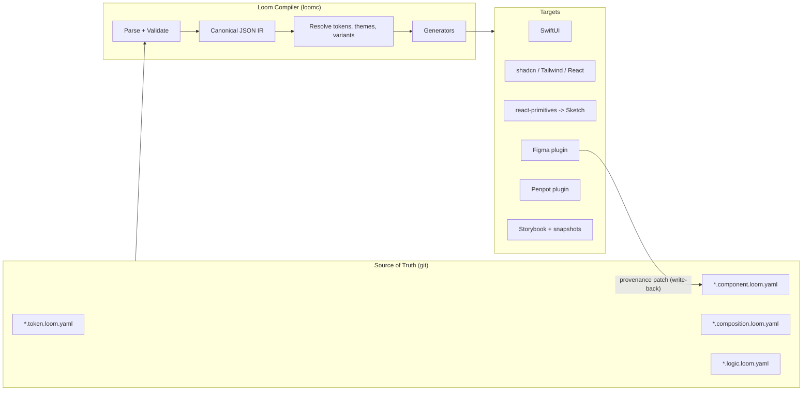

# Loom: A Universal Design Component Format

A spec for a single source of truth that compiles to every design tool and every UI stack — inspired by Lona, informed by what actually broke when trying to round-trip design files.

---

## 1. Problem Statement

Lona proved the core idea: design components can live as data, in version control, and generate real code. But Lona's format was coupled to Pug templates, JS logic, and Sketch-centric workflows. Today we have Figma variables, Penpot, Tokens Studio, the W3C Design Tokens standard, SwiftUI, and shadcn — and none of them speak to each other losslessly.

**Loom** is a component specification format that is:

- **Data-first** — pure YAML/JSON, no templating language required to author a component
- **Layout-portable** — a single layout model that maps to Figma auto-layout, flexbox, and SwiftUI stacks
- **Logic-restricted** — a deterministic, sandboxed expression language that transpiles to Swift/TS/Kotlin
- **Round-trippable** — stable IDs and provenance metadata allow design tools to diff and patch, not overwrite
- **Target-agnostic** — SwiftUI, shadcn/React, react-primitives/Sketch, Penpot, Flutter via mapping tables, not forks

### Non-goals

- Replacing Figma as a freehand exploration tool (Loom covers *systemized* UI, not artboards-in-progress)
- Being a full constraint solver (Lona tried this; it's a rabbit hole — we use a constrained flexbox model)
- Pixel-perfect bidirectional sync of arbitrary designer files — only components declared in Loom round-trip

---

## 2. Core Architecture



The compiler produces a **canonical IR** (JSON, schema-validated). Everything downstream is a projection of that IR. Design tools get *projections with provenance*, so a Figma side edit maps back to a patch on the source file.

---

## 3. File Format

### 3.1 Conventions

- Extension: `.loom.yaml` (canonical JSON `.loom.json` accepted for tooling)
- Every file declares a format version and a `kind`
- Every named entity has a stable `id` (ULID) — this is the linchpin of round-tripping
- Serialization is **deterministic** (sorted keys, fixed indent) so diffs are meaningful

```yaml
loom: "1.0"
kind: component   # token | component | composition | logic | theme | workspace
id: cmp_btn_01H8XQ...
name: Button
```

### 3.2 Workspace

```yaml
# loom.workspace.yaml
loom: "1.0"
kind: workspace
name: acme-design-system
version: 2.3.1
packages:
  - path: tokens/
  - path: components/
  - path: compositions/
targets:
  swift:
    module: AcmeUI
    minIOS: "16.0"
  web:
    framework: react
    styling: tailwind
    primitives: shadcn
  sketch:
    via: react-primitives   # react-sketchapp renderer
themes:
  - light
  - dark
```

### 3.3 File kinds

| Kind | Purpose | Analogy |
| --- | --- | --- |
| token | Atomic design values per theme | Lona tokens / W3C DTCG |
| theme | Token value overrides per theme/density | Figma modes |
| component | Parametrized UI structure + variants | Lona `.component` |
| composition | Concrete param sets = examples/screens | Lona examples / Storybook stories |
| logic | Pure functions used by components | Lona `.logic.js` |
| workspace | Package root, target config | Lona `workspace.yaml` |

---

## 4. Tokens

Loom tokens are a superset-compatible dialect of the **W3C Design Tokens (DTCG)** format. Import/export adapters exist for Tokens Studio and Style Dictionary — adopting Loom doesn't orphan your existing tokens.

```yaml
# tokens/color.loom.yaml
loom: "1.0"
kind: token
id: tok_surface_01H9AB...
type: color
name: surface.raised
description: Elevated card and popover backgrounds.
themes:
  light: "#FFFFFF"
  dark: "#14161A"
aliases:
  figmaVariable: "sys/surface/raised"
  styleDictionary: "color.surface.raised"
```

### 4.1 Token types and target mapping

| Type | SwiftUI | Tailwind/shadcn | react-primitives |
| --- | --- | --- | --- |
| color | `Color(token:)` | CSS variable `--loom-color-*` | `StyleSheet` color |
| dimension | `CGFloat` | `px`/`rem` utility or var | number |
| fontFamily | `Font.custom` | `font-family` var | `fontFamily` |
| number | `Double` | raw value | number |
| duration / easing | `Animation` | CSS `transition` | Animated.timing |
| border-radius | `RoundedRectangle` | `rounded-*` var | `borderRadius` |
| shadow | custom modifier | `shadow-*` var | `shadow*` |
| gradient | `LinearGradient` | `bg-gradient-*` | none (fallback: layered Views) |
| typography | `Font` composite | utility class | TextStyle |

Rules:

- Tokens may reference other tokens (`{surface.raised}` alias syntax, DTCG-compatible)
- Every token resolves **per theme**; unresolved theme values are a compile error
- Names are dot-namespaced and form a tree; leaf values only

---

## 5. Components

The component file is the heart of Loom. It has four sections: **params**, **variants**, **structure**, and **bindings**.

### 5.1 Full example

```yaml
loom: "1.0"
kind: component
id: cmp_btn_01H8XQ...
name: Button
version: 1.2.0
description: |
  Primary action control. Renders a pressable button with optional
  leading icon. Adapts to theme and density.

params:
  - name: label
    type: text
    required: true
    description: Visible label. Localize, never hardcode.

  - name: icon
    type: icon
    required: false
    description: Optional leading icon, resolved from the icon token set.

  - name: size
    type: enum
    values: [sm, md, lg]
    default: md
    codegen:
      swift: ButtonSize      # maps to a generated Swift enum
      web: ButtonSize

  - name: onPress
    type: action
    required: true
    description: Callback invoked on activation. Maps to closure/event.

  - name: trailing
    type: child
    maxChildren: 1
    description: Optional slot after the label.

variants:
  - name: intent
    values: [primary, secondary, ghost, destructive]
  - name: state
    values: [rest, hover, pressed, disabled]
    internal: true          # driven by interaction, not an API variant

a11y:
  role: button
  label: from param label
  traits:
    - isButton
  minimumTouchTarget: { width: 44, height: 44 }

structure:
  type: View
  layout:
    direction: horizontal
    gap: { token: spacing.2 }
    padding: { token: button.padding }     # resolved per size via logic
    align: center
    justifyContent: center
    width: hugging
    height: hugging
    cornerRadius: { token: radius.full }
  fill: { token: button.bg }
  children:
    - when: icon != null
      type: Icon
      name: { from: icon }
      size: { token: button.iconSize }
      fill: { token: button.fg }
    - type: Text
      value: { from: label }
      typography: { token: button.typography }
      fill: { token: button.fg }
    - from: trailing

logic:
  - name: buttonPadding
    inputs: [size]
    expr: |
      switch size {
        case "sm": token("spacing.2")
        case "md": token("spacing.3")
        case "lg": token("spacing.4")
      }

tokens:
  button.bg:
    intent.primary:   { ref: accent.solid }
    intent.secondary: { ref: surface.raised }
    intent.ghost:     { ref: transparent }
    intent.destructive: { ref: danger.solid }
  button.fg:
    intent.primary:   { ref: text.onAccent }
    intent.secondary: { ref: text.primary }
    intent.ghost:     { ref: text.primary }
    intent.destructive: { ref: text.onDanger }
  button.padding:
    size.sm: { ref: spacing.2 }
    size.md: { ref: spacing.3 }
    size.lg: { ref: spacing.4 }
```

### 5.2 Design decisions

**Params are typed, not free-form.** Types: `text`, `string`, `number`, `boolean`, `enum`, `color`, `icon`, `image`, `dimension`, `child` (slot), `array`, `object`, `action` (callback). `child` params become *slots* — this is how Loom handles composition without inventing a layout system for children.

**Variants are Cartesian, declared explicitly.** `internal: true` marks interaction states (hover/pressed) that map to CSS pseudo-classes, SwiftUI button styles, and Figma component *property* variants without polluting the public API.

**Structure is a node tree, not a template.** Node types are deliberately the `react-primitives` set — `View`, `Text`, `Image`, plus `Icon`, `Svg`, `Group` — because that minimal set round-trips everywhere:

| Loom node | Figma / Penpot | SwiftUI | React/shadcn | react-primitives |
| --- | --- | --- | --- | --- |
| View | Frame (auto-layout) | `HStack`/`VStack`/`ZStack` | `div` | `View` |
| Text | Text node | `Text` | `span`/`p` | `Text` |
| Image | Rectangle with fill | `Image` | `img` | `Image` |
| Icon | Component instance | symbol | lucide icon | Svg path |
| Svg | Vector node | `Path`/`Shape` | `svg` | Svg (art) |

**Conditional nodes** use `when:` expressions — compiled to SwiftUI `if let`, React `{cond && ...}`, and toggled layer visibility in design tools.

**Token scoping in the component.** The `tokens:` block maps *context* (variant, size, theme) → token refs. This keeps theme-aware variant styling declarative and diffable, and it's exactly what compiles to Figma variables with modes.

---

## 6. Layout Model

One layout model, three projections. Loom uses a **flexbox subset** (the intersection of Yoga/Taitank, Figma auto-layout, and SwiftUI stacks):

```yaml
layout:
  direction: horizontal | vertical | overlap   # overlap => ZStack / absolute
  gap: dimension | token
  padding: { top, right, bottom, left } | single value
  align: start | center | end | stretch
  justifyContent: start | center | end | spaceBetween
  width: hugging | fill | fixed(d) | percent(p)
  height: hugging | fill | fixed(d) | percent(p)
  aspectRatio: number
  cornerRadius: dimension | token
  clip: boolean
  min / max: { width, height }
```

| Loom | Figma auto-layout | SwiftUI | CSS |
| --- | --- | --- | --- |
| `width: fill` | Fill container | `.frame(maxWidth: .infinity)` | `flex: 1` / `width: 100%` |
| `width: hugging` | Hug contents | `.fixedSize()` | `width: fit-content` |
| `gap` | Item spacing | `spacing:` | `gap` |
| `overlap` | No auto-layout / absolute | `ZStack` | `position: relative` + children |

Anything outside this subset (grids, explicit absolute positioning) is allowed but marked `fidelity: best-effort` per node — codegen warns instead of silently diverging. This honesty rule was Lona's biggest missing piece.

---

## 7. Logic Language ("Loom Logic")

Lona used arbitrary JS, which made cross-platform compilation a lost cause. Loom Logic is a **pure expression language**, JSON-typed, no side effects, no DOM/platform access.

```yaml
# logic/progress.loom.yaml
loom: "1.0"
kind: logic
id: fn_pct_01H9CZ...
name: percentFromRatio
description: Converts a 0..1 ratio into a whole-number percentage.
inputs:
  - name: ratio
    type: number
output: number
expr: |
  clamp(round(ratio * 100), 0, 100)
```

- Supported: arithmetic, comparisons, boolean ops, `switch`/ternaries, string interpolation, array/object literals, `token("...")` lookups, calls to other logic functions
- Compiled to Swift, TypeScript, Kotlin, and interpreted in Figma/Penpot plugins
- Anything it can't express belongs in **target bindings** (§8), not in shared logic — if logic needs a platform API, the spec is being violated

---

## 8. Target Bindings

Built-in generators cover the default mapping. Targets customize via a **binding file** — a mapping table plus optional template overrides — never by editing generated output.

```yaml
# targets/web.loom.yaml
loom: "1.0"
kind: target
target: web
framework: react
map:
  component:
    file: "src/components/{kebab-name}/{kebab-name}.tsx"
    style: tailwind
  param.action: "({name}: () => void)"
  enum: "(type|enum) {PascalName}"
overrides:
  Button: ./bindings/web/Button.tsx.liquid   # rare; for shadcn parity
```

### 8.1 Built-in target behavior

| Target | Strategy |
| --- | --- |
| SwiftUI | One `View` per component; variants → enums; theme via `Environment`; logic inline; a11y via `.accessibility*` |
| Web / shadcn | React component matching shadcn conventions (CVA for variants, `forwardRef`, slots); tokens → CSS variables on `:root[data-theme]`; Tailwind config generated from tokens |
| react-primitives | Direct 1:1 node mapping → `react-sketchapp` renders into Sketch artboards with provenance IDs |
| Figma | Plugin generates auto-layout frames, component sets (variant per `variants` row), Figma variables for tokens; `pluginData` stores `{ loomId, sourceHash }` per node |
| Penpot | Same model as Figma via its plugin API; tokens via Penpot design tokens |
| Flutter / Compose | Same binding-table mechanism; shipped later |

### 8.2 Round-trip protocol

This is the part that makes design tools *collaborators* rather than renderers:

1. Compiler writes generated structures into Figma with each node tagged `loomId` + `sourceHash`
2. Designer edits (recolor via variable, change padding, reorder children) inside a Loom-managed component
3. Plugin walks the tree, compares each node against the IR, and emits a **patch**: `{ op: "set", id, path: "layout.gap", value: "8px" }`
4. Compiler validates patches against the schema (token refs must exist, layout must be in-subset) and applies them to the source YAML with clean diffs
5. Any untagged node is *outside* Loom — untouched, never clobbered

The same protocol drives Sketch (via react-sketchapp layers + metadata) and Penpot. Because everything carries stable ULIDs, merges and code review work the way designers actually need.

---

## 9. Compositions (Examples as Tests)

```yaml
loom: "1.0"
kind: composition
id: cmpx_btn_primary_01H9D0...
component: cmp_btn_01H8XQ...
name: "Primary, with icon"
params:
  label: "Get started"
  icon: "arrow-right"
  size: md
  intent: primary
  onPress: null        # static render; interactions are snapshot-tested in targets
canvas:
  background: { token: surface.base }
```

Compositions serve triple duty:

- **Figma preview** — each composition is generated as an instance beside the component
- **Snapshot tests** — compiled to Storybook stories, SwiftUI snapshot tests, Playwright visual tests
- **Contract checks** — compiler verifies every variant × theme combination is reachable by at least one composition, or warns

---

## 10. Versioning and Diffing

- Components are semver'd independently; the workspace version is an aggregate
- Compiler diffing detects breaking changes: removed/renamed params, changed enum values, changed param types, removed variants → **major**; added params with defaults, added variants → **minor**
- `loom diff` renders changes *visually*: a before/after composition grid for PRs — the review experience Lona never quite had
- Every generated file carries a header comment: source file, workspace version, generation timestamp (for CI staleness checks), and `loomId`

---

## 11. Repository Layout

```
acme-design-system/
├── loom.workspace.yaml
├── tokens/
│   ├── color.loom.yaml
│   ├── spacing.loom.yaml
│   └── typography.loom.yaml
├── themes/
│   └── dark.loom.yaml
├── logic/
│   └── percentFromRatio.loom.yaml
├── components/
│   └── Button/
│       ├── Button.component.loom.yaml
│       └── compositions.loom.yaml
├── compositions/
│   └── onboarding.loom.yaml
├── targets/
│   ├── swift.loom.yaml
│   └── web.loom.yaml
└── bindings/           # rare per-component overrides
    └── web/Button.tsx.liquid
```

---

## 12. Validation Rules (Compiler-enforced)

1. All token refs resolve in every declared theme — unresolved = error, not fallback
2. Every node has an `id` after first compile; missing IDs are auto-assigned and written back
3. Layout values must be in the flexbox subset or explicitly `fidelity: best-effort`
4. Logic functions are pure: no imports, no platform APIs — static analysis rejects them
5. `child` slots respect `maxChildren`; slot arity is checked per composition
6. Variant combinations referenced in `tokens:` blocks must exist in `variants:`
7. Generated output is never hand-edited — CI regenerates and fails on drift ("no stubborn fingers" rule)

---

## 13. Interop Guarantees

| Ecosystem | Guarantee |
| --- | --- |
| W3C DTCG | Token files import/export losslessly |
| Tokens Studio | Adapter with rename mapping preserved in `aliases:` |
| Style Dictionary | Token tree exported as standard config |
| shadcn/ui | Generated components follow shadcn conventions (CVA, slots, `cn()`); can *wrap* an existing shadcn component via `bindTo:` instead of generating |
| react-primitives | Node model is literally the primitives set; zero impedance mismatch |
| Figma variables/modes | Themes map 1:1 to modes; token tree maps to variable collections |

The `bindTo:` option matters for adoption: teams with existing shadcn components can adopt Loom as a *spec layer* without replacing implementation — Loom generates the Figma projection and type surface while delegating rendering.

---

## 14. Roadmap

**Phase 1 — Spec + core (weeks 1–4)**
JSON Schema for all kinds; deterministic YAML serializer; token resolution engine; `loom validate`; W3C DTCG adapter.

**Phase 2 — Two code targets (weeks 5–10)**
Compiler IR; SwiftUI generator; Web/shadcn generator; `loom dev` with live preview; composition-based snapshot tests.

**Phase 3 — Figma read path (weeks 11–14)**
Plugin generating components/variables with provenance metadata; one-way sync design ← Loom.

**Phase 4 — Round-trip (weeks 15–20)**
Patch protocol, diff review tool, conflict resolution UX.

**Phase 5 — Breadth**
react-sketchapp/Sketch pipeline, Penpot plugin, Flutter/Compose targets, Loom Logic transpilation to Kotlin.

**Open questions to resolve during Phase 1**

- Nested slots with `direction` constraints — how much layout authority do slots carry?
- Should responsive breakpoints be in the spec or per-target bindings? (Lean: bindings, since SwiftUI size classes and Tailwind breakpoints don't share a model.)
- Icon set normalization — lucide for web is easy; SwiftUI needs a symbol-name mapping table per icon token.

---

## 15. The One-Paragraph Pitch

Loom is Lona's thesis rebuilt for 2026: components are versioned data with typed params, a portable flexbox subset, sandboxed pure logic, and per-theme token bindings. A single compiler emits idiomatic SwiftUI, shadcn-compatible React, and react-primitives for Sketch — while a provenance-tagged patch protocol lets Figma and Penpot stay in the loop as editors, not just renderers. Design reviews the system; code compiles it; and the repo stays the single source of truth.
