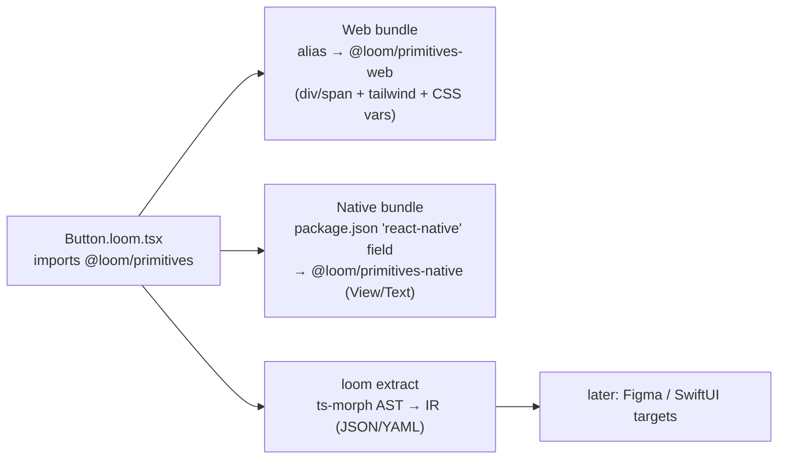

# Loom MVP: TSX-First, Composable Primitives

Good instinct — and it inverts Lona's biggest mistake. Lona made designers write YAML and treated code as output. Your MVP treats **code as the source** and extracts the data format later. This works because the insight hiding in `react-primitives` is even stronger today: if components are written against an abstract primitive set, you don't need codegen for portability — you need **module aliasing**. The YAML/JSON IR becomes an *extraction* job, not an authoring burden.

---

## 1. The Core Trick: No Codegen in the MVP

Write components once in TSX using SwiftUI-flavored primitives. The import `@loom/primitives` resolves differently per platform:



- **Web**: alias via bundler config → primitives implemented with `div`/`span`, Tailwind classes, CSS variables (shadcn-compatible)
- **React Native**: the `react-native` field in `package.json` points to a native entry — Metro resolves it *automatically*, no config needed. This is exactly how react-native-web achieves dual-platform
- **Extraction**: a separate CLI pass parses the same TSX into the Loom IR. The IR is a *byproduct*, always regenerable, never hand-maintained

This means the MVP ships with **zero codegen** for the two hardest targets (web + native) and codegen only where it pays: standalone shadcn components.

---

## 2. The Primitive Set

Modeled on SwiftUI's layout primitives — small, orthogonal, composable. This is the entire surface area.

### 2.1 Layout

| Primitive | SwiftUI | Web impl | RN impl |
| --- | --- | --- | --- |
| HStack | `HStack` | flex row | View row |
| VStack | `VStack` | flex col | View col |
| ZStack | `ZStack` | relative container | View + absolute children |
| Spacer | `Spacer` | `flex: 1` | View with `flex: 1` |
| Divider | `Divider` | `hr` / border | View hairline |
| Grid | `LazyVGrid` | CSS grid | flex-wrap fallback (MVP: defer) |

### 2.2 Content

| Primitive | Web impl | RN impl |
| --- | --- | --- |
| Text | span/p | Text |
| Image | img | Image |
| Icon | lucide component | vector or RN vector lib |
| Pressable | button/a with role | Pressable |

### 2.3 Stack props (shared across H/V/ZStack)

```ts
type StackProps = {
  gap?: number | string              // spacing token key or raw value
  padding?: Spacing | SpacingShorthand
  align?: "start" | "center" | "end" | "stretch"
  justify?: "start" | "center" | "end" | "spaceBetween"
  width?: "hugging" | "fill" | number | string
  height?: "hugging" | "fill" | number | string
  background?: ColorToken            // token name, never raw hex in components
  cornerRadius?: RadiusToken
  // ZStack only: alignment of children within the stack
}
```

These names deliberately match the layout model from the full spec — so the IR extraction is a 1:1 read of the props you're already writing. `hugging`/`fill` map to `fit-content`/`100%` on web and flex grow/shrink behavior on RN.

### 2.4 Tokens, not literals

Components reference tokens by name; primitives resolve them per platform:

```ts
// tokens.ts — single source, compiled to CSS vars (web) and a theme object (RN)
export const tokens = {
  color: {
    surface: "#FFFFFF",
    surfaceRaised: "#F4F5F7",
    textPrimary: "#18181B",
    accent: "#635BFF",
    onAccent: "#FFFFFF",
  },
  spacing: { 1: 4, 2: 8, 3: 12, 4: 16, 6: 24 },
  radius: { sm: 6, md: 8, full: 999 },
} as const
```

Web build emits these as `--loom-color-surface` etc. **Critically, the web token emitter also emits the shadcn-compatible aliases** (`--background: var(--loom-color-surface)`, `--primary: var(--loom-color-accent)`), so Loom components and existing shadcn components read from the same variable namespace and can be mixed on one page from day one.

---

## 3. Authoring a Component

```tsx
// components/Button/Button.loom.tsx
import {
  HStack, Text, Icon, Pressable, PressableProps,
} from "@loom/primitives"
import { tokens } from "../../tokens"

// Param types are plain TS — the extractor maps them to Loom param types.
export type ButtonProps = PressableProps & {
  /** Visible label. Localize, never hardcode. */
  label: string
  /** Optional leading icon name. */
  icon?: IconName
  size?: "sm" | "md" | "lg"
  intent?: "primary" | "secondary" | "ghost" | "destructive"
}

export function Button({ label, icon, size = "md", intent = "primary", ...rest }: ButtonProps) {
  return (
    <Pressable
      role="button"
      background={buttonBackground(intent)}
      cornerRadius="full"
      padding={paddingFor(size)}
      {...rest}
    >
      <HStack gap={2} align="center" justify="center" width="hugging" height="hugging">
        {icon && <Icon name={icon} size={iconSize(size)} color={buttonForeground(intent)} />}
        <Text typography={typographyFor(size)} color={buttonForeground(intent)}>
          {label}
        </Text>
      </HStack>
    </Pressable>
  )
}

// Pure local helpers — extractor inlines these into the IR as logic.
const paddingFor = (s: ButtonProps["size"]) =>
  ({ sm: 2, md: 3, lg: 4 })[s] as Spacing

const buttonBackground = (intent: NonNullable<ButtonProps["intent"]>) =>
  ({
    primary: "accent",
    secondary: "surfaceRaised",
    ghost: "transparent",
    destructive: "danger",
  })[intent] as ColorToken
```

Rules the extractor enforces (this is what keeps the IR derivable):

1. Only primitives from `@loom/primitives` may be used — no raw `div`, `View`, or `Text` from any platform package (lint rule + extractor check)
2. Colors/spacing/radii must be token names or token-typed values, never raw hex/px
3. Local helper functions must be pure — same restriction as Loom Logic, but written in TS you already know
4. Props must be typed with the whitelisted param types; the JSDoc comment becomes IR documentation
5. Conditional children (`icon && ...`) extract to IR `when:` conditions — no `useEffect`, no state in MVP components (stateful variants come later via `useLoomState`, a restricted hook)

### 3.1 MDX: docs, compositions, and variants live together

```mdx
{/* components/Button/Button.docs.mdx */}
import { Meta, Canvas, Controls } from "@loom/docs"
import { Button } from "./Button.loom"

<Meta component={Button} title="Button" />

# Button

Primary action control. Adapts to intent, size, and theme.

<Controls />
<Canvas intent="primary" label="Get started" icon="arrowRight" />
<Canvas intent="secondary" label="Learn more" />
<Canvas intent="ghost" label="Skip" />
<Canvas intent="destructive" label="Delete" />
<Canvas intent="primary" size="sm" label="Small" />

<VariantTable />   {/* renders the full intent × size matrix, flags gaps */}
```

The MDX frontmatter and `<Meta>` block carry the workspace metadata (component id, version, a11y role). `<Canvas>` instantiations become IR compositions — the same triple duty as the full spec: docs, Storybook stories, and later, Figma previews.

---

## 4. shadcn Output

For the MVP, the *runtime* web path (aliased primitives) already produces shadcn-compatible styling via CSS variables. Codegen adds one thing: **standalone components with zero Loom dependency**, matching shadcn conventions exactly so they can be dropped into any shadcn project.

```bash
loom gen web --standalone
```

```tsx
// dist/web/src/components/loom/button.tsx   (generated — do not edit)
import { cva, type VariantProps } from "class-variance-authority"
import { cn } from "@/lib/utils"
import * as React from "react"

const buttonVariants = cva("inline-flex items-center justify-center rounded-full font-medium", {
  variants: {
    intent: {
      primary: "bg-primary text-primary-foreground hover:bg-primary/90",
      secondary: "bg-secondary text-secondary-foreground hover:bg-secondary/80",
      ghost: "hover:bg-accent hover:text-accent-foreground",
      destructive: "bg-destructive text-destructive-foreground hover:bg-destructive/90",
    },
    size: {
      sm: "h-8 px-3 text-sm gap-2",
      md: "h-10 px-4 text-sm gap-2",
      lg: "h-12 px-6 text-base gap-2",
    },
  },
  defaultVariants: { intent: "primary", size: "md" },
})

export interface ButtonProps
  extends React.ButtonHTMLAttributes<HTMLButtonElement>,
    VariantProps<typeof buttonVariants> {
  label: string
  icon?: React.ReactNode
}

export const Button = React.forwardRef<HTMLButtonElement, ButtonProps>(
  ({ label, icon, intent, size, className, ...props }, ref) => (
    <button ref={ref} className={cn(buttonVariants({ intent, size }), className)} {...props}>
      {icon}
      {label}
    </button>
  ),
)
Button.displayName = "Button"
```

The generator's mapping table (Loom intent → CVA variant → Tailwind class) is data, declared once per project — so it's tunable without forking the compiler. Generated output carries the `loomId` in a header comment for drift detection in CI.

**Extraction** is the inverse direction and always available:

```bash
loom extract components/ -o .loom/        # JSON IR, deterministic, gitignored or committed
loom extract components/ -f yaml          # the Lona-style format, when you want it
```

Because TSX is parsed via AST (ts-morph), extraction is sound for anything following the rules — and *loud* about anything that doesn't, rather than silently lossy.

---

## 5. Repository Layout

```
loom-design-system/
├── loom.config.ts
├── tokens.ts                      # single token source
├── primitives/
│   ├── src/                       # shared types + stack semantics
│   ├── web/                       # div/span + tailwind impl
│   └── native/                    # RN impl (View/Text/Pressable)
├── components/
│   └── Button/
│       ├── Button.loom.tsx
│       └── Button.docs.mdx
├── app/                           # demo app (react-native-web runs everywhere)
├── .loom/                         # extracted IR (generated)
└── dist/
    └── web/                       # standalone shadcn output (generated)
```

Platform resolution for `@loom/primitives`:

```jsonc
// packages: the native entry is picked up by Metro automatically
{
  "name": "@loom/primitives",
  "main": "dist/web/index.js",
  "module": "dist/web/index.js",
  "react-native": "dist/native/index.js",
  "types": "dist/shared/index.d.ts"
}
```

---

## 6. MVP Scope Cuts

| In | Out (deferred) |
| --- | --- |
| 8 primitives + stack props | Grid, absolute positioning beyond ZStack |
| Tokens → CSS vars + shadcn aliases + RN theme object | Multi-theme/dark mode (add as a second token map, cheap later) |
| TSX authoring + MDX compositions | Hand-authored YAML |
| IR extraction to JSON/YAML | IR → Figma/Sketch round-trip |
| Standalone shadcn codegen | SwiftUI codegen (the IR is already the right shape for it) |
| Pure helper functions as logic | Loom Logic expression language — plain TS *is* the logic language for now; extraction just records it |
| Lint: no raw platform imports, no raw color literals | Sandbox/interpreter for logic |

The dark-mode cut is worth noting: because components reference token names, adding a dark theme is adding one token map + emitting `[data-theme="dark"]` vars and an RN theme provider — no component changes.

---

## 7. Roadmap

**Phase 1 — Primitive runtime (weeks 1–3)**
`@loom/primitives` shared types + web/native implementations; token emitter (CSS vars + shadcn aliases + RN theme); demo app running in browser and on device via react-native-web.

**Phase 2 — Authoring + extraction (weeks 3–5)**
ts-morph-based extractor → JSON IR (the schema from the full spec, minus logic IR); lint rules; `loom extract` CLI.

**Phase 3 — shadcn codegen (weeks 5–7)**
Standalone component generator with CVA; mapping table config; CI drift check.

**Phase 4 — Docs + verification (weeks 7–9)**
MDX pipeline → Storybook stories + variant-matrix coverage report; visual snapshot tests on web (Playwright) and native.

**Phase 5 — The payoff**
IR → SwiftUI generator (the `hugging`/`fill`/`gap` model was designed for this mapping), IR → Figma plugin for read-only preview. Because Phases 1–4 produced a real IR from real usage, the format you end up with is one that was *proven* against three platforms rather than designed in a vacuum.

---

## 8. The One-Paragraph Pitch

The MVP is a react-primitives successor with a SwiftUI accent: eight composable primitives (`HStack`, `VStack`, `ZStack`, `Text`, `Icon`, `Image`, `Pressable`, `Spacer`) with token-based styling, implemented twice (web + React Native) behind one import that platform tooling resolves automatically. Components are authored in TSX with docs and variant canvases in MDX; a parser extracts the Loom IR (JSON/YAML) as a byproduct, and a generator emits dependency-free shadcn components from a configurable mapping table. Codegen is a feature, not a prerequisite — so the MVP ships value in week one, and the universal file format emerges from evidence instead of speculation.
