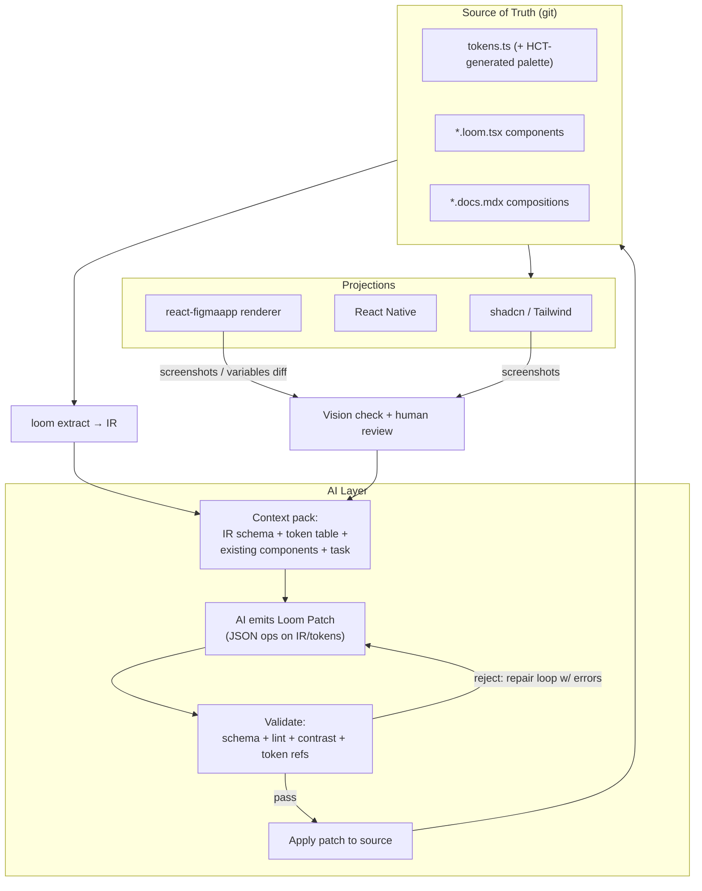

# Loom MVP + AI: Declarative Design Generation with Code as Truth

Yes — and this closes the loop in a way that finally justifies the whole architecture. The pieces you named fit together as a system: **primitives as the render target for AI output, the IR as the AI's contract, Material's HCT color engine for generative-but-tasteful tokens, and Figma as a *verifiable canvas* rather than a source of truth.**

The key reframing: AI shouldn't generate "designs" (images, arbitrary Figma files). It should generate **design system instances** — token assignments, variant combinations, compositions — written into a format that is small, schema-validated, and diffable. That's what the IR already is.

---

## 1. The Loop



Two details make this safe and cheap:

- **AI never touches generated files or Figma directly.** It emits a declarative *patch* against the IR/source. Patches are validated before anything renders. Rejection loops are cheap because the validator's error messages are machine-readable.
- **Figma is a feedback instrument.** The `react-figmaapp` renderer produces real, inspectable Figma output from the same primitives; screenshots flow back into the AI loop for vision-based verification ("does this look balanced?", "is contrast readable?") — and humans review in the tool they already know.

---

## 2. AI-Native Authoring Format: The Loom Patch

The IR schema doubles as the AI's output format — but AI speaks in *operations*, not files:

```json
{
  "loom": "1.0",
  "kind": "patch",
  "intent": "Add a filter chip row to the Catalog page composition",
  "ops": [
    { "op": "setToken", "name": "color.accent", "seed": "#635BFF" },
    { "op": "regeneratePalette", "from": "color.accent" },
    {
      "op": "upsertComponent",
      "name": "FilterChip",
      "id": "cmp_chip_NEW01",
      "params": [
        { "name": "label", "type": "text", "required": true },
        { "name": "selected", "type": "boolean", "default": false }
      ],
      "structure": {
        "type": "Pressable",
        "role": "button",
        "background": "$selected ? 'accentSoft' : 'surfaceRaised'",
        "cornerRadius": "full",
        "children": [
          { "type": "Text", "value": { "from": "label" },
            "color": "$selected ? 'onAccent' : 'textPrimary'" }
        ]
      }
    },
    {
      "op": "upsertComposition",
      "component": "cmp_page_catalog_01H9",
      "name": "With filters",
      "params": { "filters": ["Runnable", "Seated", "Outdoor"] }
    }
  ]
}
```

Why ops instead of freeform TSX:

1. **Validation is total.** Every op checks against schema, lint rules, token existence, and contrast before touching source. Freeform TSX can only be linted probabilistically; ops are checked exhaustively.
2. **Diffs are reviewable.** A patch is a PR-sized, human-readable change set — "set accent, regenerate palette, add FilterChip, extend catalog composition" — not a wall of generated code.
3. **The repair loop works.** Validator errors ("token `accentSoft` does not exist; nearest: `accentMuted`", "Text `onSurface` on `surface` fails 4.5:1 at tone 62 — suggest tone 30") become the AI's next prompt context.

TSX output is still *the end state* — applying an `upsertComponent` op writes real `.loom.tsx` into the repo via the existing extractor's inverse. Humans can then edit that TSX freely; the next AI patch diffs against IR re-extracted from the human-edited source. Neither side owns the file exclusively; **the repo does**.

---

## 3. Material Design Color Engine: Generative but Tasteful

Raw AI color choice is how systems become ugly. Instead, AI (and designers) pick **seed colors and roles**, and the palette is generated with [Material Color Utilities](https://github.com/material-foundation/material-color-utilities) in the HCT space — which guarantees hue/chroma/tone relationships stay coherent, unlike HSL arithmetic.

```ts
// loom/colors.ts — palette generation, deterministic, committed output
import {
  argbFromHex, hexFromArgb, Hct, TonalPalette,
} from "@material/material-color-utilities"

export function generatePalette(seeds: {
  accent: string        // AI/designer picks these; everything else is derived
  neutral?: string
  danger?: string
}) {
  const tone = (seed: string, t: number) =>
    hexFromArgb(TonalPalette.fromInt(argbFromHex(seed)).tone(t))

  // HCT contract: tone = lightness (0–100). Contrast is a tone-delta problem,
  // so pairs are chosen by delta, not by eye.
  return {
    accent:       { base: tone(seeds.accent, 40), soft: tone(seeds.accent, 90),
                    onAccent: tone(seeds.accent, 100) },
    surface:      { base: tone(seeds.neutral ?? "#FAFAFA", 99),
                    raised: tone(seeds.neutral ?? "#FAFAFA", 96),
                    onSurface: tone(seeds.neutral ?? "#FAFAFA", 15) },
    danger:       { base: tone(seeds.danger ?? "#B3261E", 40),
                    onDanger: tone(seeds.danger ?? "#B3261E", 100) },
    text:         { primary: tone(seeds.neutral ?? "#FAFAFA", 15),
                    muted: tone(seeds.neutral ?? "#FAFAFA", 45) },
  }
}
```

What this buys:

- **Tweaks are principled.** "Make it darker, less saturated" = tone −10, chroma −20 in HCT — and every dependent pair (soft, onAccent, muted) re-derives coherently. No broken combinations.
- **Contrast is computed, not hoped for.** HCT tone deltas approximate WCAG ratios; the validator enforces minimum deltas for text/background pairs (4.5:1 body, 3:1 large) and emits *suggested tones* in AI rejection messages.
- **Dark mode is a tonal inversion**, so it's essentially free — flip the tone mapping, verify deltas, done.
- **Determinism** means the same seeds always produce the same palette — the palette lives in git as generated output with the seed config as source.

### 3.1 Tailwind tokens (one source, four formats)

The token emitter reads `tokens.ts` and produces:

| Format | Emitted as |
| --- | --- |
| CSS variables | `--loom-color-accent-base`, plus shadcn aliases `--primary: var(--loom-color-accent-base)` |
| Tailwind config | `theme.extend.colors` mapped to the CSS vars (opacity-compatible: RGB channels + `<alpha-value>`), so `bg-accent/50` works |
| React Native | theme object + provider (`useLoomTheme()`) |
| Figma | variables/collections via the react-figmaapp plugin |

Because shadcn aliases are emitted from the same source, Loom components and stock shadcn components stay visually married even after the palette is regenerated. AI can *regenerate the whole palette from a mood prompt* ("warmer, quieter, more premium") → seeds in HCT space → all four formats update as one diff.

---

## 4. react-figmaapp: Primitives → Figma

A third implementation of the primitives interface, modeled on react-figma (the react-sketchapp lineage for Figma): components render to real Figma nodes through the Plugin API instead of DOM or native views.

| Loom primitive | Figma node | Notes |
| --- | --- | --- |
| HStack / VStack | Frame with auto-layout (horizontal/vertical), `itemSpacing = gap`, `padding` | `width: "fill"` → `layoutSizingHorizontal: FILL` |
| ZStack | Frame, `layoutMode: NONE`, children absolute | alignment → child constraints |
| Text | Text node with typography styles | color → bound variable |
| Icon / Image | Vector / rectangle with image fill | |
| Pressable | Component (variant set member) | rest/hover/pressed from `state` variants |
| Tokens | Figma variables | mode per theme; color pairs checked with Figma's contrast plugin API |
| Component | Figma component set | one variant per `intent × size`; loomId in `pluginData` |

This is also the **provenance substrate** from the full spec: every rendered node carries `{ loomId, irHash }` in `pluginData`, so the Figma document is a *projection with a diffable identity* — enabling both:

- **Read-back**: designers tweak padding/spacing/color in Figma; the plugin diffs against the IR and proposes source patches (same patch format as AI)
- **AI verification**: compositions render headlessly via the plugin, screenshots come back into the loop

### 4.1 Code/design mappings for diff updates

The compiler maintains a **projection manifest** — the "mapping" that makes updates minimal instead of rebuild-everything:

```json
{
  "cmp_btn_01H8XQ": {
    "web":    { "file": "dist/web/src/components/loom/button.tsx", "variant": "cva.button" },
    "native": { "file": "src/components/Button.tsx", "styleId": "btn.root" },
    "figma":  { "nodeId": "1:234", "variants": ["intent=primary/size=md"] }
  },
  "tok_color_accent_base": {
    "web":    { "var": "--loom-color-accent-base", "tailwind": "colors.accent" },
    "native": { "theme": "color.accent.base" },
    "figma":  { "variableId": "VariableID:12:5" }
  }
}
```

Diff updates become surgical:

| Source change | Web update | Native update | Figma update |
| --- | --- | --- | --- |
| Token value | rewrite CSS var value | theme object value | `setVariableById` — instant, all instances |
| Variant added | new CVA variant + mapping | new style variant | new component variant in set |
| Layout prop | className / style rewrite | StyleSheet rewrite | auto-layout property patch |
| Component added | new generated file | new file | new component set on canvas |

Because every artifact carries its loomId, `loom sync` computes a three-way diff (source IR ↔ manifest ↔ live projection) and emits the minimal patch per target — no re-importing, no re-generating untouched files, no clobbering designer work outside Loom-managed nodes.

---

## 5. What the AI Is Actually Allowed to Do

A capability ladder keeps generation safe and progressively ambitious:

| Level | Capability | Mechanism | Risk |
| --- | --- | --- | --- |
| 0 | Recolor / re-seed palette | `setToken` + `regeneratePalette` | near zero (HCT + contrast validate) |
| 1 | Compose existing components into pages/screens | `upsertComposition` | low (components are pre-verified) |
| 2 | New components from existing primitives + tokens | `upsertComponent` | medium (schema + lint + contrast) |
| 3 | New primitives / layout patterns | PR proposal only, human-authored merge | high — by design out of loop |

Level 3 is the honesty boundary: primitives are the *alphabet*; AI writes *sentences* with them. When AI keeps needing a primitive that doesn't exist, that's a signal to a human, not a prompt-engineering problem.

Practical context pack per task (kept small enough for cheap prompts): IR schema excerpt, token table with contrast relationships, IR of the 5 most-similar components, the target composition, and recent patches as few-shot examples.

---

## 6. Revised Repository Layout

```
loom-design-system/
├── loom.config.ts
├── tokens.ts                      # seeds + roles (source)
├── generated/
│   ├── palette.ts                 # HCT-derived (deterministic, committed)
│   ├── tailwind.config.ts         # theme.extend + shadcn aliases
│   └── manifest.json              # loomId → projection mappings
├── primitives/
│   ├── src/  web/  native/
│   └── figma/                     # react-figmaapp renderer + plugin
├── components/*/(*.loom.tsx, *.docs.mdx)
├── compositions/
├── ai/
│   ├── prompts/                   # task templates per capability level
│   ├── patches/                   # AI patch history (reviewable, git-tracked)
│   └── verify/                    # screenshot snapshots + vision-check reports
└── dist/
```

---

## 7. Roadmap Delta

**Phase 1–3 unchanged** (primitives, extraction, shadcn codegen).

**Phase 4 — react-figmaapp (weeks 7–9, pulls forward)**
Primitives → Figma renderer with variables + auto-layout + variant sets; headless render of compositions; projection manifest v1 (tokens + components).

**Phase 5 — Token engine (weeks 9–10)**
HCT palette generator + contrast validator; Tailwind/shadcn/RN/Figma emitters from one source; dark mode via tonal inversion.

**Phase 6 — AI loop (weeks 10–14)**
Patch format + validator with repair-loop errors; capability ladder 0 → 2; screenshot feedback into prompts; patch history as reviewable PRs.

**Phase 7 — Read-back**
Figma edits → source patches via provenance diff; same validator gates them, so designer and AI edits flow through one audit trail.

---

## 8. The One-Paragraph Pitch

The AI layer works because every participant speaks through the same narrow channel: tokens and primitives. AI proposes declarative patches (palette re-seeds via Material's HCT engine, new components from the eight primitives, compositions from verified parts); a total validator — schema, lint, HCT contrast — accepts or returns actionable errors; accepted patches land as real TSX/token diffs in git. The same sources project to shadcn/Tailwind, React Native, and Figma through the primitives library's three implementations, with a manifest mapping every loomId to its generated artifacts so updates are surgical diffs in all three. Code stays the truth; Figma becomes the review room; and AI becomes a fast, constrained member of the design team instead of a source of beautiful chaos.
